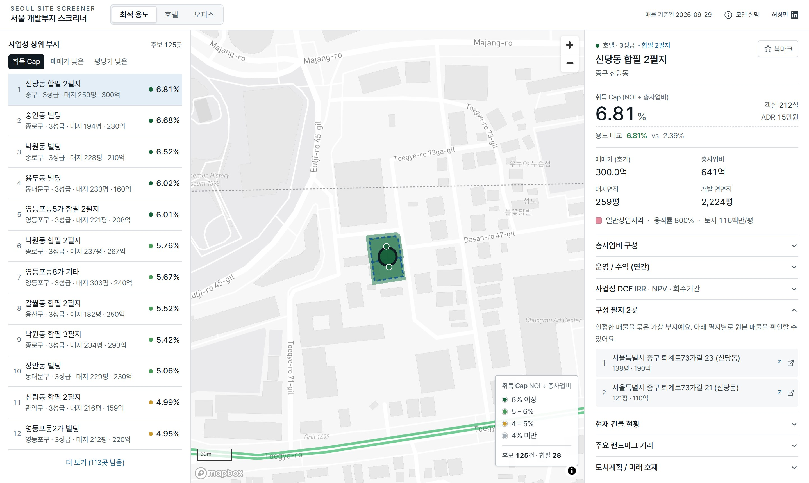
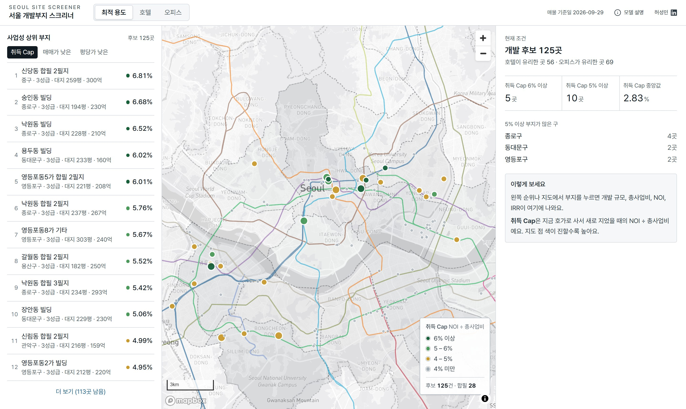
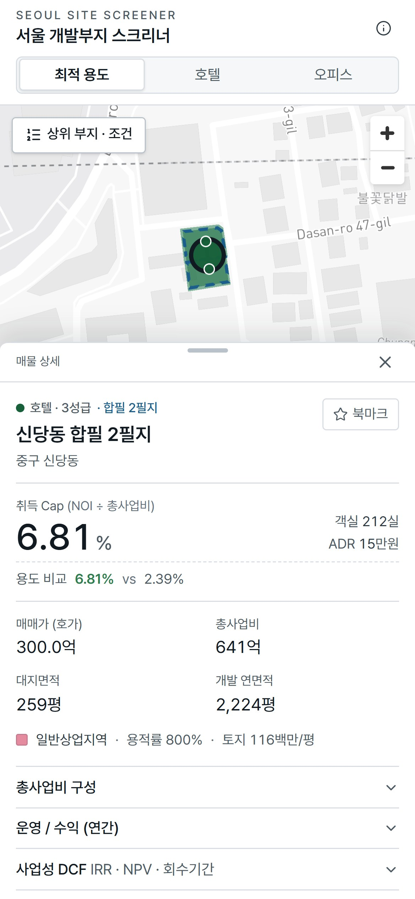
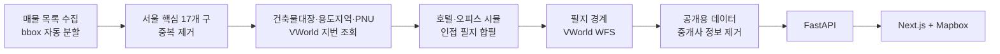

# 서울 개발부지 스크리너

서울 핵심 17개 구에 매물로 나온 빌딩·상가를, **지금 호가로 사서 허용 용적률만큼 호텔이나 오피스로 새로 지으면 사업성이 나오는지** 한 화면에서 추정해 주는 도구입니다. 개발 부지를 찾는 실무자가 검토를 시작할 후보를 빠르게 좁히는 것을 목표로 만들었습니다.



<table>
  <tr>
    <td width="68%"></td>
    <td width="32%"></td>
  </tr>
</table>

- **사업성 순위**: 매물마다 취득 Cap(안정화 NOI ÷ 총사업비)을 계산해 높은 순으로 보여 줍니다. 지도 색도 같은 기준입니다.
- **최적 용도**: 같은 부지를 호텔과 오피스로 각각 시뮬레이션하고, 신축 가능한 용도지역에서 취득 Cap이 높은 쪽을 고릅니다.
- **합필 검토**: 필지 경계가 실제로 맞닿은 인접 매물을 묶어 합필 개발 시나리오를 함께 계산합니다.
- **DCF**: 부지를 누르면 공사 → 안정화 → 매각 현금흐름으로 IRR, NPV, 회수기간을 보여 줍니다.
- **가정값 조정**: ADR, 점유율, NOC, 공사비, 매각 Cap 같은 가정을 바꾸면 전체 순위가 다시 계산됩니다.

## 사업성 계산

| 단계 | 호텔 | 오피스 |
|---|---|---|
| 개발 규모 | 대지 × 용도지역 최대 용적률(지상) + 대지 × 60%(지하) | 같음 |
| 등급·규모 | 연면적 1,500 / 3,000 / 7,000평 기준 3·4·5성급. 객실수는 객실당 연면적 약 35 / 54 / 89㎡ 기준 | 연면적 기준 소형·중형·중대형·대형 |
| 매출 | ADR × 점유율 × 365 × 객실수 + F&B | 전용면적(연면적 × 50%) × 권역별 NOC × 12 |
| NOI | GOP − 운영사 수수료(매출 2% + GOP 8%) − FF&E 3% − 재산세 | 임대수입 − 임대면적 × 운용비 3만원/평/월 × 12 |
| 총사업비 | 매입가 + 공사비 + 부대비 6% + 건설이자(LTV 60%, 2년) | 같음 |
| **취득 Cap** | **NOI ÷ 총사업비** | **NOI ÷ 총사업비** |

- 호텔 ADR은 자치구 입지 Tier(1~4)로 보정하고, 숙박 수요 거점 역(명동·동대문·홍대·강남 등)에서 800m 밖이면 보정율을 10%p 낮춥니다.
- 오피스 NOC는 CBD, GBD, YBD, 기타 권역으로 나눕니다. CBD(종로·중구)와 GBD(강남·서초구)는 핵심 역에서 700m 안일 때만, YBD는 여의도동만 인정하고 나머지는 모두 기타입니다. 같은 구라도 업무지구에서 떨어진 곳에 프라임 NOC를 주지 않기 위해서입니다.
- 후보에서 빼는 매물: 호가·면적 입력 오류(평당가 이상치), 큰 건물·단지의 호실·대지지분, 같은 건물 중복 등재, 현재 건물이 이미 개발 가능 연면적의 2/3 이상이거나 준공 30년 미만이면서 절반 이상 지어진 것, 이전 조사 대비 호가가 30% 미만으로 내려간 것(자릿수 누락). 합필에도 같은 기준을 통과한 필지만 합산합니다.
- 가정값은 모두 [`config/default.yaml`](config/default.yaml)에 있고, 화면의 "시뮬 가정값"에서 바꿔 볼 수 있습니다.
- 공식은 [`tests/test_simulation.py`](tests/test_simulation.py)로 검증합니다.

## 데이터 파이프라인



| 경로 | 역할 |
|---|---|
| `src/naver_crawler/` | 수집 → 필터 → 보강 → 시뮬 → 필지 → 내보내기 6단계 파이프라인 (`python -m naver_crawler run`) |
| `src/naver_crawler/transforms.py` | 시뮬레이션 핵심 (`compute_dev_metrics`, `select_use`) |
| `src/naver_crawler/grouping.py` | 인접 매물 묶기 (union-find) |
| `api/app/` | FastAPI — 용도·가정값별 재계산, 필지 인접성 검증(Shapely STRtree), DCF |
| `web/src/` | Next.js 16 + Mapbox GL — 순위, 지도, 상세, 가정값 조정 |
| `scripts/export_public.py` | 배포용 데이터 생성 (중개사 정보 제거, 필드 최소화, gzip) |
| `vercel.json` · `server.py` | Vercel Services 배포 (웹 + API 한 도메인) — [DEPLOYMENT.md](DEPLOYMENT.md) |

## 로컬 실행

필요한 것: Python 3.12+, Node.js 22+, [Mapbox 공개 토큰](https://account.mapbox.com/).

```bash
python -m venv .venv
source .venv/bin/activate          # Windows: .venv\Scripts\activate
pip install -e ".[dev]"
uvicorn server:app --port 8000
```

```bash
cd web
cp .env.example .env.local        # NEXT_PUBLIC_MAPBOX_TOKEN 입력
npm install
npm run dev
```

http://localhost:3000 에서 확인합니다. 저장소에 포함된 `data/published/articles.json.gz`로 바로 동작하며, 크롤링은 필요하지 않습니다.

데이터를 새로 만들려면 `.env`에 VWorld API 키를 넣고 파이프라인을 실행합니다.

```bash
pip install -e ".[crawler]"
python -m playwright install chrome
python -m naver_crawler run
python scripts/export_public.py
```

테스트:

```bash
python -m pytest
```

## 데이터 출처

| 데이터 | 출처 |
|---|---|
| 매물 호가·면적 | 네이버부동산 공개 매물 (호가, 수집일 기준) |
| 용도지역·건축물 정보 | 건축물대장 (네이버부동산 경유), 국토교통부 VWorld |
| 필지 경계 | 국토교통부 VWorld WFS (연속지적도) |
| 자치구 경계 | [southkorea/seoul-maps](https://github.com/southkorea/seoul-maps) (통계청 2013) |
| 지하철 노선·역 | © [OpenStreetMap](https://www.openstreetmap.org/copyright) contributors (ODbL) |
| 배경 지도 | © Mapbox © OpenStreetMap |

## 한계

- 매물 가격은 공개된 **호가**이며 실거래가가 아닙니다.
- ADR, NOC, 공사비, 매각 Cap 같은 가정값은 공개 리포트 수준의 대략치입니다.
- 인허가 조건(지구단위계획, 높이 제한, 주차), 기존 임차인, 명도 비용은 반영하지 않습니다. 준주거·준공업지역의 호텔은 관광진흥법상 사업계획 승인을 받는 관광숙박시설을 전제로 합니다.
- 순위는 취득 Cap 하나로 매깁니다. 매각 Cap이 더 높은 입지에서는 취득 Cap이 높아도 DCF의 IRR이 낮게 나올 수 있습니다.
- 중개사 연락처 등 개인정보는 수집하지 않습니다.

개인 포트폴리오 프로젝트입니다. 네이버와 제휴하지 않았고, 투자 판단의 근거로 쓰도록 만든 도구가 아닙니다.

## 만든 사람

허성민 · 부동산 개발 검토 · [LinkedIn](https://www.linkedin.com/in/sungmin-heo-824a6a1a5/)

MIT License
